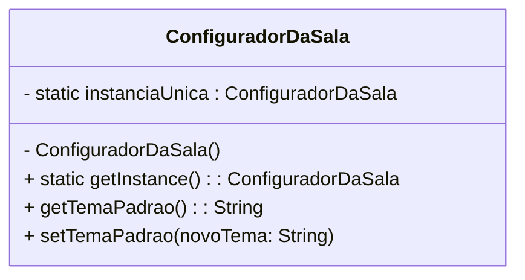

# Atividade-Singleton

**Disciplina:** Linguagens e Técnicas de Programação III (LPIII)
**Objetivo:** Estudo e implementação do Padrão de Projeto Criacional Singleton.

### 1.1 - O problema que o Singleton resolve

Um Singleton, por definição, é uma instância única acessível globalmente dentro do projeto. Ele resolve o problema de centralizar o controle de um recurso específico, garantindo que apenas um ponto do sistema seja responsável por gerenciá-lo.

A necessidade surge quando múltiplas instâncias podem causar:

1. Inconsistência de dados, caso diferentes partes do sistema acessem estados distintos.
2. Uso desnecessário de recursos, como criação repetida de conexões ou objetos pesados.

Exemplos de uso:

1. Gerenciadores de configuração: Asseguram que todo o sistema leia o mesmo conjunto de parâmetros.
2. Loggers: Controlam a escrita sequencial em arquivos ou consoles.
3. Acesso a recursos compartilhados: Como pools de conexão ou dispositivos físicos.

### 1.2 - A solução do padrão Singleton

O Singleton controla a criação da instância e centraliza o acesso a ela. Sua solução baseia-se em três pontos:

-> Construtor privado: Impede a criação direta de novas instâncias.
-> Campo estático privado: Armazena a única instância da classe.
-> Método público de acesso: (getInstance()) retorna a instância única, criando-a apenas quando necessário.

### 1.3 - Um diagrama simples (UML)

### 2.0 - Um código de exemplo
